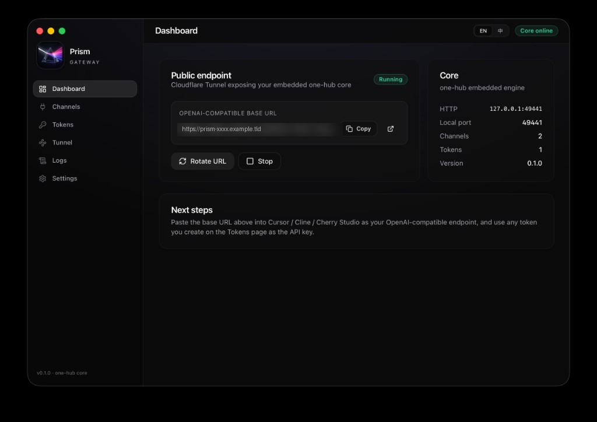

# Prism

A desktop app that runs a local LLM gateway on your Mac/Windows/Linux box and exposes it as an OpenAI-compatible endpoint, so Cursor, Cline, Cherry Studio, or anything else that talks `/v1/chat/completions` can hit one URL and reach 37 providers behind it.

Read this in [简体中文](./README.zh-CN.md).



[](https://www.gnu.org/licenses/agpl-3.0)
[](https://github.com/autogame-17/prism/releases)
[](https://go.dev/)
[](https://wails.io/)

## What it is

Prism wraps the [one-hub](https://github.com/MartialBE/one-api) gateway as a Wails (Go + React) desktop app. The gateway runs in-process — no Docker, no separate `docker-compose.yml`, no port hunting. The app also bundles a `cloudflared` binary, so one click gives you a public `*.trycloudflare.com` URL when you want to share the endpoint with a teammate or a remote agent.

What you get:

- One OpenAI-compatible HTTP endpoint, local or temporarily public.
- 37 providers behind it: OpenAI, Anthropic, Gemini, Bedrock, Vertex AI, DeepSeek, Groq, Zhipu, Moonshot, …
- A real desktop UI for managing channels, tokens, request logs, and full request/response traces.
- A copy-paste snippet generator that produces ready-to-use Cursor / Cline / Cherry Studio configs.

It is one binary. No external services required.

## Why Prism exists

I wanted to use Cursor and Cline against several providers (some only reachable through a proxy, some only available regionally) without juggling N config files, and without running another always-on Docker container on my laptop. one-hub solves the routing problem; Prism is the part that makes one-hub usable as a daily-driver desktop tool: configuration UI that doesn't fight you, a public URL on demand, and full traffic capture so when a provider returns a weird 400 you can see exactly what went over the wire.

## Install

Grab a build from [Releases](https://github.com/autogame-17/prism/releases):

| Platform | File |
| --- | --- |
| macOS (Intel + Apple Silicon) | `Prism-vX.Y.Z-darwin-universal.dmg` |
| Windows amd64 | `Prism-vX.Y.Z-windows-amd64-installer.exe` (NSIS) or `.zip` (portable) |
| Linux amd64 | `Prism-vX.Y.Z-linux-amd64.tar.gz` |

Releases are unsigned. First-run notes:

```bash
# macOS Gatekeeper
xattr -dr com.apple.quarantine /Applications/Prism.app
```

On Windows, SmartScreen will warn — "More info" → "Run anyway". On Linux, you need GTK 3 and `libwebkit2gtk-4.1-0` (default on Ubuntu 22.04+, Fedora 39+, Debian 12+).

## Five-step setup

1. Launch Prism. The onboarding card walks you through it.
2. **Channels → New** — pick a provider, paste an API key.
   - Bedrock key format: `region|AccessKeyID|SecretAccessKey`.
   - For providers blocked from your network (e.g. Anthropic / Gemini direct from China), put your local proxy in **Outbound proxy**, e.g. `http://127.0.0.1:7890`.
3. **Tokens → New** — give it a name. "Unlimited quota" is fine for single-user setups.
4. **Dashboard → Start tunnel** — Prism launches `cloudflared` and shows you a public URL within a few seconds. (Or skip the tunnel and use `http://127.0.0.1:<port>` from the same machine.)
5. On the Tokens page, click the snippet icon, pick your client, and paste the resulting JSON into Cursor / Cline / Cherry Studio.

## What's actually in here

- **Embedded one-hub.** No separate process. The Go binary imports the gateway as a library, registers its routes on a `gin.Engine`, and listens on a chosen local port. SQLite by default; switching to MySQL / Postgres still works (`SQL_DSN` env var).
- **Tunnel, with no Cloudflare account.** `cloudflared` is bundled per-platform (`go:embed`) and run as a child process; the app parses its log to surface the public URL in the UI. No tunnel-config file, no zero-trust setup needed.
- **Traces.** A small Gin middleware tees the request body and the response body (including SSE streams) into a SQLite table. When a provider returns `tools.0.custom.name: Field required` and the wrapper says "Provider API error", the actual upstream payload is one click away in the Logs → Traces view.
- **macOS menu bar.** A native `NSStatusItem` (CGO + Objective-C, not a third-party systray library — those collide with Wails' own `AppDelegate`). Closing the window keeps the process running, drops the Dock icon, and leaves the menu bar item with Start/Stop tunnel and Copy URL actions.
- **Theming and i18n.** Light/dark themes, English/中文.

## Patches against one-hub

Vendored at `backend/core/`. Notable diffs from upstream (`MartialBE/one-api`):

- `core/providers/claude/chat.go` — when a client like Cursor sends Anthropic-shaped tools to the OpenAI-compatible endpoint, the upstream rejected them with `tools.0.custom.name: Field required`. Patched to set `type: "custom"` and to thread `input_schema` through correctly.
- `core/providers/gemini/chat.go` — top-level `system` prompts and array-style system messages now both aggregate into Gemini's expected `systemInstruction` field.
- `core/common/gin.go` — `ErrorWrapper` no longer swallows the underlying network error behind the generic "请求上游地址失败". The original `dial tcp …` / `i/o timeout` is appended to the response body so it shows up in Traces.
- `core/providers/bedrock/*` — Anthropic-on-Bedrock tool schema fixed to match the patches above.
- `backend/prism/capture/middleware.go` — new. Non-destructive body tee with a `gin.ResponseWriter` proxy that handles streaming and stores everything to `prism_traces`.

If a one-hub upstream PR lands that obsoletes any of these, the diff goes away.

## Build from source

```bash
# prerequisites: Go 1.24+, Node 20+, pnpm 9+
go install github.com/wailsapp/wails/v2/cmd/wails@latest

# fetch the cloudflared binaries (not in git — too big, fetched at build time)
./scripts/fetch_cloudflared.sh

wails dev                                # hot reload
wails build -platform darwin/universal   # production build
wails build -platform windows/amd64 -nsis
wails build -platform linux/amd64 -tags webkit2_41
```

The artefact lands in `build/bin/`.

User config lives at:

- macOS: `~/Library/Application Support/Prism/`
- Windows: `%APPDATA%/Prism/`
- Linux: `~/.config/Prism/`

…and contains `prism.yaml` (runtime config; secrets auto-generated on first launch), `prism.db` (SQLite), and `logs/`.

## Releases

Pushing a `v*.*.*` tag triggers `.github/workflows/release.yml`, which builds the matrix on macOS / Windows / Linux runners and uploads the artefacts to the corresponding GitHub Release. To produce just one platform on demand:

```bash
gh workflow run release.yml --ref main \
  -f tag=v0.1.1 \
  -f platforms=linux-amd64
```

## Contributing

Patches are welcome. Conventions in [`CONTRIBUTING.md`](./CONTRIBUTING.md). Please don't paste real API keys into bug reports — Prism's Traces view is private to your machine, so screenshots from there are usually safer than copy-pasted JSON.

Security issues: see [`SECURITY.md`](./SECURITY.md).

## License

[AGPL-3.0-or-later](./LICENSE).

Why AGPL: Prism is a network service — it speaks an OpenAI-compatible HTTP API to remote clients. AGPL covers exactly that case: anyone running a modified Prism over a network has to make their source available to its users. It also matches the copyleft expectations of the embedded [one-hub](https://github.com/MartialBE/one-api) (GPL-3.0), which permits redistribution under stricter copyleft.

## Acknowledgements

- [one-hub](https://github.com/MartialBE/one-api) — the gateway core. Prism is roughly "one-hub minus the docker-compose, plus a desktop UI".
- [Wails](https://wails.io/) — the Go-React desktop framework that makes embedding Go gateway code into a native window not painful.
- [cloudflared](https://github.com/cloudflare/cloudflared) — the public-URL story.
